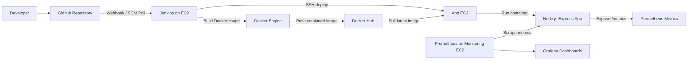

# DevOps Node.js Capstone

End-to-end CI/CD pipeline for a containerized Node.js web application deployed on AWS EC2 with Jenkins, Docker Hub, and Prometheus/Grafana monitoring.

## Project Overview

This capstone demonstrates a production-style DevOps workflow for a Node.js + Express application. The application is containerized with Docker, built and published through Jenkins, deployed to an AWS EC2 instance, and instrumented with Prometheus metrics for observability.

The project covers:

- Source control with Git and GitHub
- CI/CD automation with Jenkins
- Containerization with Docker
- Image publishing to Docker Hub
- Cloud deployment on AWS EC2
- Application metrics with `prom-client`
- Infrastructure and application monitoring with Prometheus and Grafana

> Note: The AWS EC2 instances used for the original deployment have been terminated to avoid ongoing cloud costs. The pipeline and deployment flow documented here reflect the working capstone setup and can be recreated on new EC2 instances.

## Architecture



### Deployment Flow

1. A developer pushes code to the `main` branch on GitHub.
2. Jenkins checks out the latest source code.
3. Jenkins builds the Docker image from the project `Dockerfile`.
4. Jenkins tags the image with both the Jenkins build number and `latest`.
5. Jenkins authenticates with Docker Hub and pushes both tags.
6. Jenkins connects to the application EC2 instance over SSH.
7. The application EC2 instance pulls the latest image and restarts the `capstone-app` container.
8. Prometheus scrapes application metrics from `/metrics`.
9. Grafana visualizes infrastructure and application metrics.

## Tech Stack

| Layer | Technology |
| --- | --- |
| Application | Node.js, Express, EJS |
| Metrics | prom-client |
| Containerization | Docker |
| CI/CD | Jenkins |
| Image Registry | Docker Hub |
| Cloud Platform | AWS EC2 |
| Monitoring | Prometheus, Grafana |
| Source Control | Git, GitHub |

## Repository Structure

```text
devops-node-capstone/
|-- app/
|   |-- public/
|   |   `-- style.css
|   |-- views/
|   |   |-- about.ejs
|   |   |-- dashboard.ejs
|   |   `-- index.ejs
|   |-- package-lock.json
|   |-- package.json
|   `-- server.js
|-- Dockerfile
|-- Jenkinsfile
`-- README.md
```

## Application Features

- Express web server running on port `3000`
- EJS-rendered pages for home, about, and dashboard views
- Static assets served from `app/public`
- Runtime dashboard showing hostname, uptime, and memory usage
- Prometheus-compatible metrics endpoint at `/metrics`
- HTTP request counter exposed as `node_app_http_requests_total`
- Default Node.js process metrics exposed with the `node_app_` prefix

## Local Development

Clone the repository:

```bash
git clone https://github.com/prapanjanprabhu/devops-node-capstone.git
cd devops-node-capstone/app
```

Install dependencies:

```bash
npm install
```

Start the application:

```bash
npm start
```

Open the application:

```text
http://localhost:3000
```

Available routes:

| Route | Description |
| --- | --- |
| `/` | Home page |
| `/about` | About page |
| `/dashboard` | Runtime dashboard |
| `/metrics` | Prometheus metrics endpoint |

## Docker Usage

Build the image from the repository root:

```bash
docker build -t prapanjanprabhu/devops-node-capstone .
```

Run the container:

```bash
docker run -d --name capstone-app -p 3000:3000 prapanjanprabhu/devops-node-capstone
```

Open the containerized application:

```text
http://localhost:3000
```

## Jenkins CI/CD Pipeline

The Jenkins pipeline is defined in `Jenkinsfile`.

Pipeline stages:

1. Checkout source code
2. Build Docker image
3. Tag image as `${BUILD_NUMBER}` and `latest`
4. Log in to Docker Hub using Jenkins credentials
5. Push both image tags to Docker Hub
6. SSH into the application EC2 instance
7. Pull the latest image
8. Stop and remove the old container if it exists
9. Start the updated container with restart policy enabled
10. Log out from Docker Hub after the pipeline completes

Image naming pattern:

```text
prapanjanprabhu/devops-node-capstone:<BUILD_NUMBER>
prapanjanprabhu/devops-node-capstone:latest
```

Required Jenkins credentials:

| Credential ID | Purpose |
| --- | --- |
| `dockerhub-user` | Docker Hub username/password |
| `app-ec2-ssh` | SSH key for the application EC2 instance |

## AWS Deployment Reference

Original deployment environment:

| Resource | Value |
| --- | --- |
| Region | `ap-south-1` |
| Instance Type | `t3.micro` |
| Jenkins Host | `jenkins-ec2` |
| Application Host | `app-ec2` |
| Monitoring Host | `monitor-ec2` |

Deployment command executed by Jenkins on the application host:

```bash
docker pull prapanjanprabhu/devops-node-capstone:latest
docker stop capstone-app || true
docker rm capstone-app || true
docker run -d --name capstone-app --restart unless-stopped -p 80:3000 prapanjanprabhu/devops-node-capstone:latest
```

When deployed, the app listens inside the container on port `3000` and is exposed publicly through port `80` on the EC2 instance.

## Monitoring

The application exposes Prometheus metrics at:

```text
/metrics
```

Key metrics include:

- `node_app_http_requests_total`
- Default Node.js process metrics collected by `prom-client`

The original monitoring setup used Prometheus to scrape the application and Grafana to visualize:

- CPU usage
- Memory usage
- Disk usage
- HTTP request count
- Application availability

## Results

- Automated Docker image build and deployment through Jenkins
- Docker Hub image versioning using Jenkins build numbers
- Repeatable EC2 deployment using Docker
- Application-level Prometheus metrics
- Grafana dashboards for operational visibility
- Restart-safe container deployment with `--restart unless-stopped`

## Future Enhancements

- Add Prometheus and Grafana configuration files to the repository
- Add backup and cleanup automation scripts
- Integrate Trivy for container image scanning
- Add Alertmanager for monitoring alerts
- Store backups in AWS S3
- Add GitHub Actions as an alternative CI/CD workflow
- Implement blue-green or rolling deployment strategy

## License

This project was developed as an DevOps capstone submission.
